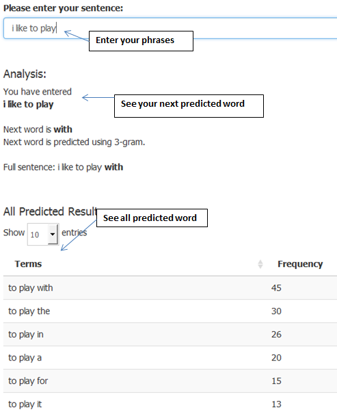
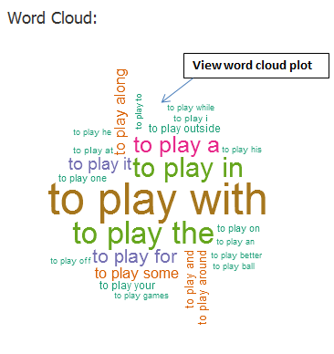

Word Prediction Application
========================================================
author: Thomas Lee Wai Siong
date: April 16th, 2016
transition: rotate
transition-speed: fast
rtl: false
font-family: 'Helvetica'
Why you should use Word Prediction Application?

What is Word Prediction?
========================================================
incremental: false
type: prompt

Now we are entering into the brand new technology world especially we can see those new emerging technology such as mobile app, tablet devices, IoT, cloud service and so on. Human nowadays send a lot of texts and type a lot of words by using these devices. This leads to the major evolution of how human type to sending these texts. In order to improve user experience, <strong>Swiftkey</strong> has contributed significant effort to build a smart keyboard that makes it easier for people to sending the text on their mobile or tablet devices. Instead of typing, they can swipe to sending the text.

Thus, the main objective of this capstone project is to build a predictive text product in R by using <strong>Text Mining</strong> and <strong>Natural Language Processing (NLP)</strong> techniques.

At the end of this product, it will help to predict the words that user might wants to type and their next preditive word.

In this project, we will be using the samples data of <strong>Twitter</strong>, <strong>News</strong> and <strong>Blogs</strong> in this data exploratory session. All the text will be based on English.

How the Model and Algorithm work?
========================================================
incremental: false
type: alert

<strong>The methods that I have used are</strong>

- <strong>n-gram model</strong>: Type of probabilistic language model for predicting the next item in such a sequence based on the Markov model.

- <strong>Katz back-off</strong>: generative n-gram language model that estimates the conditional probability of a word given its history in the n-gram.

- <strong>Steps 1:</strong> Download the data at [Here](https://eventing.coursera.org/api/redirectStrict/dMPEcWgTuQwgPFzwJi8zGASGZiNrJQDg-31ttnosJA3N48xqcJcKjx0ezj09QGkBnn_TzuaBoMLR4TnGrmubYQ.RhVhoBZ0kN3zATsE8tSKzw.OtpVXLWxz6rmxfXzzW9e3xTPt4IqQyW1l_P0ZBN7oJn5_uB4w8b5TnMwMZ3Xn-ytjeZYxgqCG1QE8ib8NyVab88e6ajqwKnnVj3r8_J3WcyaLdtvexS0gxkgW2p7AqHNbZf9w1aNBuk-MaweZLj7iAlNOs0pHDLZ3xtFO7dcBIZrmdskTejx6ym5fnUmmzxYeM7KIy6rCKN_QSpaqXL_6JSeMtjm3O2QcAyqSNzJV5bz2XNvszEfe8k7MpW-7eOoaTYNFCUYcd-Ii3hVd-LnMdusWnlYX1KJutzS3d7y9LHrAipLj4AeMshW32VndDokAOS_KL6_wioLwyjqO1QbDgLNZ3xEMNH9m84TwUkQrDYUKYrci901GHnBlkuBtUvmUwuprBmlG8V2E-C_WDiikMAapAX3G5Brqaje02WpWDc) and get 7% of sample data from each of the sources and then merged into one.
 
- <strong>Steps 2:</strong> Clean the data like removing number, whitespaces, profanity words and others.
 
- <strong>Steps 3:</strong> Develop four sets of word combinations (n-grams), with 4-words, 3-words, 2-words, and 1-word. 

***

- <strong>Steps 4:</strong> Get their cumulative frequencies, sort them and save them into new data file as R-Compressed files (.RData files).
 
- <strong>Steps 5:</strong> Firstly, we use a FourGram to predict the next word. The FourGram is already sorted from highest to lowest frequency in new RData files.
 
- <strong>Steps 6:</strong> If FourGram is not found, we will use ThreeGram to predict the next word
 
- <strong>Steps 7:</strong> If ThreeGram is not found, we will use TwoGram to predict the next word
 
- <strong>Steps 8:</strong> If TwoGram is not found, we will use OneGram to predict the next word
 
- <strong>Steps 9:</strong> If OneGram is not found, we will select the highest frequency in OneGram dataset.

Word Prediction Application
========================================================
incremental: false
type: prompt

Objective: <strong>Word Prediction Application to predict your next word by providing your phrases.</strong>

Features:
- Predict your next term by entering your <strong>phrases</strong>.
- Generate all predicted terms in <strong>table format</strong>.
- Generate all predicted terms in <strong>word cloud format</strong>.

How to Use:
- You can go to tab <strong>"Quiz Prediction"</strong> and select the quiz question in drop down list or go to tab <strong>"Text Prediction"</strong> and enter your sentences in text box.
- You can see your next predicted term in <strong>"Analysis"</strong> section.
- You can see all the predicted terms in table format in <strong>"All Predicted Results"</strong> section.
- You can see all the predicted terms in word cloud format in <strong>"Word Cloud"</strong> section.

Try it out?
========================================================
incremental: false

Shiny Application:

***

- You can read full Data Exploratory Report at [Here](http://rpubs.com/flyingfox22/MilestoneReport1)
- You can play the Word Prediction Application at [Here](https://leewaisiong.shinyapps.io/WordPredictionApp/)
- You can access the Word Prediction Code at [GitHub](https://github.com/flyingfox22/WordPredictionApp)
- You can preview the Presentation Code at [GitHub](https://github.com/flyingfox22/WordPredictionAppPresentation) and [Rpubs](http://rpubs.com/flyingfox22/WordPredictionPresentation)

